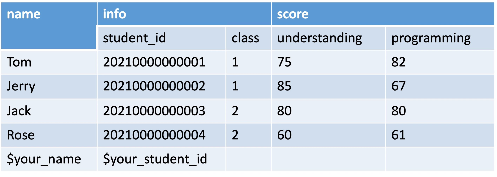
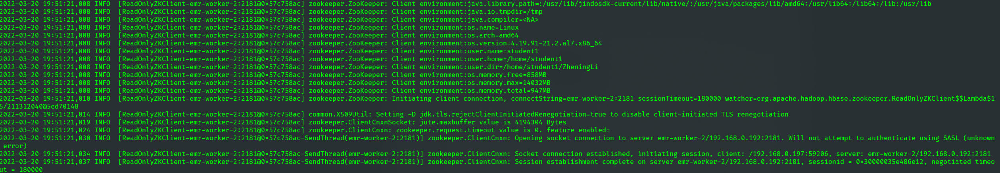
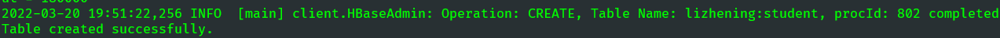
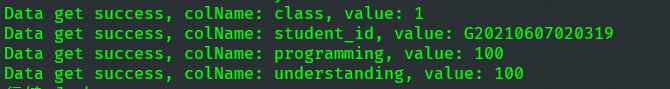
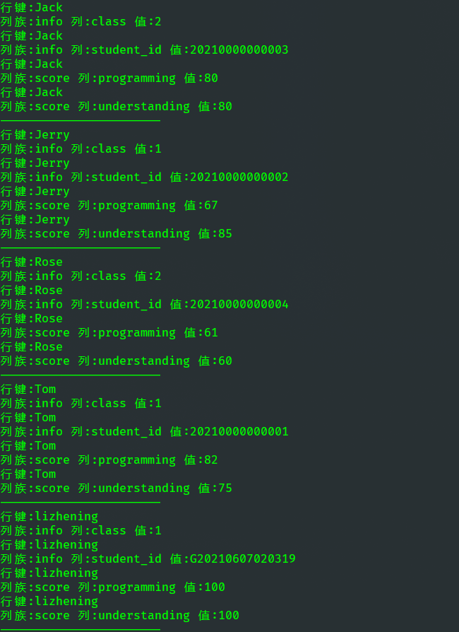
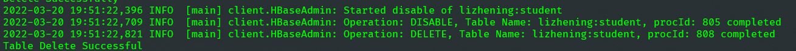
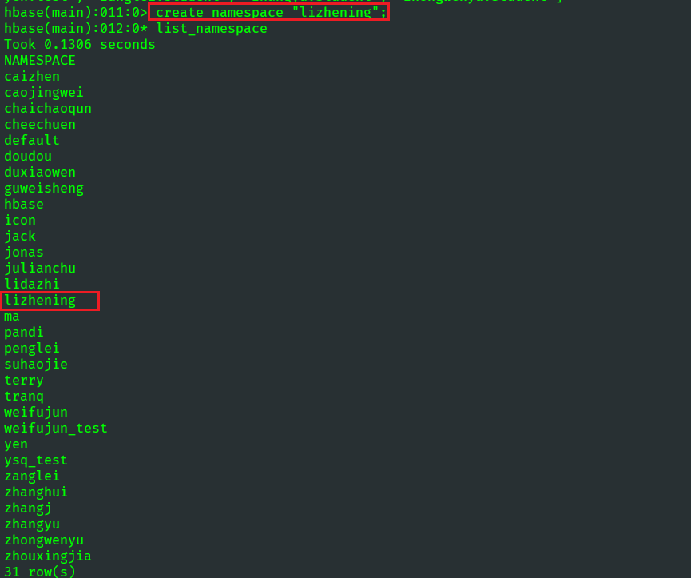

## 使用 Java API 操作 HBase
建表，实现插入数据，删除数据，查询等功能。建立一个如下所示的表
- 表名：$your_name:student
- 空白处自行填写, 姓名学号一律填写真实姓名和学号



### 建立连接
```java
        //获取Configuration对象
        Configuration configuration = HBaseConfiguration.create();
        //对hbase客户端来说，只需知道hbase所经过的Zookeeper集群地址即可
        // 因为hbase的客户端找hbase读写数据完全不用经过HMaster
        configuration.set("hbase.zookeeper.quorum", "emr-worker-2");
        configuration.set("hbase.zookeeper.property.clientPort", "2181");
        //获取连接
        Connection conn = ConnectionFactory.createConnection(configuration);
```
在上述代码中，先初始化Configuration配置对象和Connection连接对象；然后是客户端对象的初始化方法，主要是获取Configuration配置对象和Connection连接对象以及指定Zookeeper集群的地址。

运行结果：



### 建表
```java
        //获取表管理器对象
        Admin admin = conn.getAdmin();
        // 定义表名和列族名
        TableName tableName = TableName.valueOf("lizhening:student");
        String colFamily1 = "info";
        String colFamily2 = "score";

        if (admin.tableExists(tableName)) {
            System.out.println("Table already exists");
        } else {
            //创建表的描述对象，并指定表名
            HTableDescriptor hTableDescriptor = new HTableDescriptor(tableName);
            //构造第一个列族描述对象，并指定列族名
            HColumnDescriptor hcd1 = new HColumnDescriptor(colFamily1);
            //构造第二个列族描述对象，并指定列族名
            HColumnDescriptor hcd2 = new HColumnDescriptor(colFamily2);
            //将列族描述对象添加到表描述对象中
            hTableDescriptor.addFamily(hcd1).addFamily(hcd2);
            //利用表管理器来创建表
            admin.createTable(hTableDescriptor);
            System.out.println("Table created successfully.");
        }
```
在上述代码中，代码获取HBase表管理器对象admin、创建表的描述对象tableDescriptor并指定表名、创建两个列族描述对象hcd1、hcd2并指定列族名；将列族描述对象添加到表描述对象中；使用表管理器来创建表；

运行结果：



### 插入数据
```java
        //创建table对象，通过table对象来添加数据
        Table table = conn.getTable(tableName);
        //创建一个集合，用于存放Put对象
        ArrayList<Put> puts = new ArrayList<Put>();
        //构建put对象（KV形式），并指定其行键
        Put put1 = assembleData("Tom","20210000000001","1","75","82");
        Put put2 = assembleData("Jerry","20210000000002","1","85","67");
        Put put3 = assembleData("Jack","20210000000003","2","80","80");
        Put put4 = assembleData("Rose","20210000000004","2","60","61");
        Put put5 = assembleData("lizhening","G20210607020319","1","100","100");
        //把所有的put对象添加到一个集合中
        puts.add(put1);
        puts.add(put2);
        puts.add(put3);
        puts.add(put4);
        puts.add(put5);
        //提交所有的插入数据的记录
        table.put(puts);
        System.out.println("All data insert successfully.");
```
上述代码中，创建一个表对象table，用于插入数据；创建一个集合puts，主要用于存放Put对象；使用辅助函数assembleData实现插入数据的构建；代码将前面创建的多个对象添加到puts集合中，并通过表对象table提交插入数据的记录；

辅助函数 assembleData 接收行键和对应列族列的数据，返回一个put对象：
```java
    public static Put assembleData(String rowKey, String val1, String val2, String val3, String val4){
        //构建put对象（KV形式），并指定其行键
        Put put = new Put(Bytes.toBytes(rowKey));
        put.addColumn(Bytes.toBytes("info"), Bytes.toBytes("student_id"), Bytes.toBytes(val1));
        put.addColumn(Bytes.toBytes("info"), Bytes.toBytes("class"), Bytes.toBytes(val2));
        put.addColumn(Bytes.toBytes("score"), Bytes.toBytes("understanding"), Bytes.toBytes(val3));
        put.addColumn(Bytes.toBytes("score"), Bytes.toBytes("programming"), Bytes.toBytes(val4));
        return put;
    }
```

运行结果：```All data insert successfully.```

### 查看数据
```java
        // 创建get查询参数对象，指定要获取的是哪一行
        Get get = new Get(Bytes.toBytes("lizhening"));
        if (!get.isCheckExistenceOnly()) {
            //返回查询结果的数据
            Result result = conn.getTable(tableName).get(get);
            //遍历所有的cell
            for (Cell cell : result.rawCells()) {
                String colName = Bytes.toString(cell.getQualifierArray(), cell.getQualifierOffset(), cell.getQualifierLength());
                String value = Bytes.toString(cell.getValueArray(), cell.getValueOffset(), cell.getValueLength());
                System.out.println("Data get success, colName: " + colName + ", value: " + value);
            }
        }
```
上述代码中，创建一个对象get，并指定要查看数据表行键为lizhening所有数据；代码通过表对象table调用get()方法把行键为lizhening的所有数据放到集合cells中；代码遍历打印集合cells中的所有数据；

运行结果：



### 扫描数据
```java
        //创建scan对象
        Scan scan = new Scan();
        //获取查询的数据
        ResultScanner scanner = table.getScanner(scan);
        //获取ResultScanner所有数据，返回迭代器
        //遍历迭代器
        for (Result result : scanner) {
            //获取当前每一行结果数据
            //获取当前每一行中所有的cell对象
            List<Cell> cells = result.listCells();
            //迭代所有的cell
            for (Cell c : cells) {
                //获取行键
                byte[] rowArray = c.getRowArray();
                //获取列族
                byte[] familyArray = c.getFamilyArray();
                //获取列族下的列名称
                byte[] qualifierArray = c.getQualifierArray();
                //列字段的值
                byte[] valueArray = c.getValueArray();
                //打印rowArray、familyArray、qualifierArray、valueArray
                System.out.println("行键:" + new String(rowArray, c.getRowOffset(), c.getRowLength()));
                System.out.print("列族:" + new String(familyArray, c.getFamilyOffset(), c.getFamilyLength()));
                System.out.print(" " + "列:" + new String(qualifierArray, c.getQualifierOffset(), c.getQualifierLength()));
                System.out.println(" " + "值:" + new String(valueArray, c.getValueOffset(), c.getValueLength()));
            }
            System.out.println("-----------------------");
        }
```
上述代码中，创建一个全表扫描对象scan；代码通过表对象table调用getScanner()方法扫描表中的所有数据，并将扫描到的所有数据存放入迭代器中；代码遍历输出迭代器中的数据；

运行结果：



### 删除数据
```java
        // 获取delete对象,需要一个 Row Key
        Delete delete = new Delete(Bytes.toBytes("Tom"));
        table.delete(delete);
        System.out.println("Delete Successfully");
```

运行结果： ```Delete Successfully```

### 删除表
```java
        // 7.删除表
        if (admin.tableExists(tableName)) {
            admin.disableTable(tableName);
            admin.deleteTable(tableName);
            System.out.println("Table Delete Successful");
        } else {
            System.out.println("Table does not exist!");
        }
```
运行结果：




### 代码编译及执行

- 上传写好的HBaseTest.java文件到服务器的个人文件夹下
- 编译代码，使用命令```javac -cp `hbase classpath` HBaseTest.java -d .```，会生成编译好的class，在指定的包路径下./com/zhening/hbase
- 运行代码，使用命令```java -cp .:`hbase classpath` com.zhening.hbase.HBaseTest```

### 注意事项
需要先创建对应的 namespace 命名空间，不然会报错```Caused by: org.apache.hadoop.hbase.ipc.RemoteWithExtrasException(org.apache.hadoop.hbase.NamespaceNotFoundException): org.apache.hadoop.hbase.NamespaceNotFoundException: lizhening```。

可以用过hbase shell，或者 Java API来创建。我这里选择使用hbase shell来创建。进入到hbase shell后，执行```create_namespace "lizhening";```。

